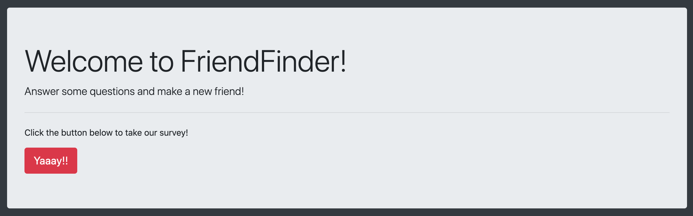
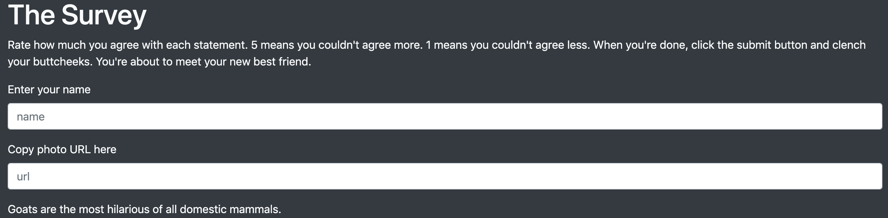
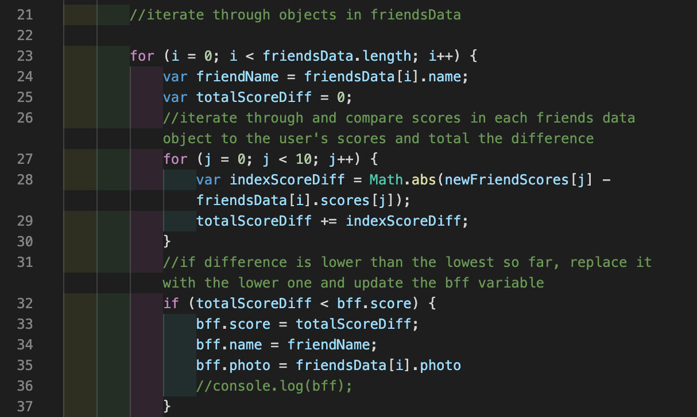
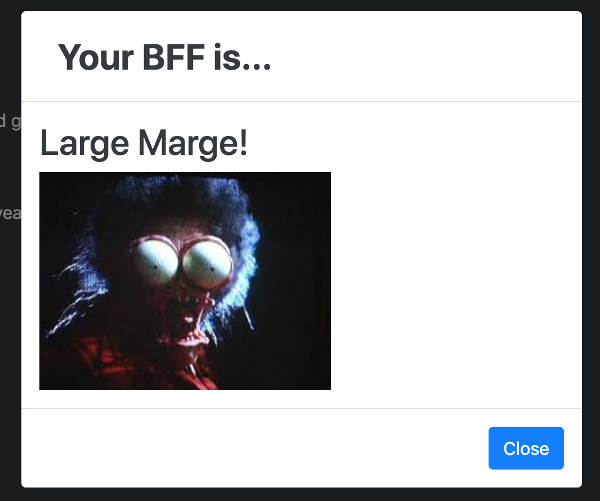

# FriendFinder

A basic web app that asks users to take a survey and then matches them to a friends based on the results of the survey. 

## Technologies Used

* Node.js
    * Express
    * Path
* Javascript
* jQuery
* Bootstrap
* Heroku

## How it works

Friend Finder opens to a home page that prompts the user to click a button to take a survey. 

When they do, the survey loads. The user must enter thier name and submit a photo url. Them, the user takes the survey, agreeing or disagreeing with statements on a 1-5 scale.

After submission, the app calculates the difference between the user's answers and the answers of previous users (in this case dummy data). Thisis accomplished with the following code:

Then, a modal is dsipalyed with the name and photo of the "previous user" whose score most closely matches that of the user. 

After that, two are bffs forever!

